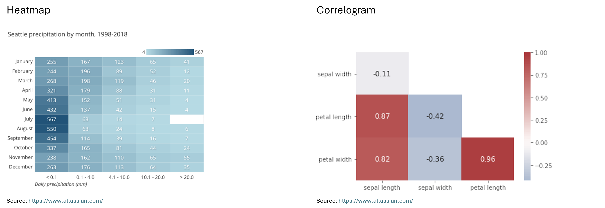

:::::::::::::::::::::::::::::::::::::: questions 

- Why is data visualization important in humanities research?
- What are some effective graph types for use in humanities research?

::::::::::::::::::::::::::::::::::::::::::::::::

::::::::::::::::::::::::::::::::::::: objectives

- Discuss the benefits of data visualization in humanities research.
- Explore the most effective graph types for data visualization in the humanities.

::::::::::::::::::::::::::::::::::::::::::::::::

::::::::::::::::::::::::::::::::::::: challenge 

## Question

Why is it helpful to visualize data in humanities research?

:::::::::::::::::::::::: solution 

## Answer
 
Data visualization has multiple purposes. It can help you understand trends and correlations in a dataset. 
It can also help you introduce a dataset to others in scientific texts or in data storytelling.

:::::::::::::::::::::::::::::::::
::::::::::::::::::::::::::::::::::::::::::::::::

Most graphs used for data visualization fall into one of the following four general categories, based on their function. 
In this lesson, we won’t cover how to create all of these graphs in Python, but will focus on a few that are 
useful for statistical inference and data storytelling with our specific dataset. However, 
it's helpful to know the names of these graphs and understand the contexts in which they can be applied.

## 1. Explore Relationships between two or more Features

**Scatter Plot:** "A scatter plot (aka scatter chart, scatter graph) uses dots to represent values for two different 
numeric variables. The position of each dot on the horizontal and vertical axis indicates values for an individual 
data point. Scatter plots are used to observe relationships between variables." 
([Atlassian](https://www.atlassian.com/data/charts/what-is-a-scatter-plot)) For example, the X-axis can represent 
the age of the employees at a company, where the Y-axis represents their income.

**Bubble Chart:** "A bubble chart (aka bubble plot) is an extension of the scatter plot used to look at 
relationships between three numeric variables. Each dot in a bubble chart corresponds with a single data point, 
and the variables’ values for each point are indicated by horizontal position, vertical position, and dot size." 
([Atlassian](https://www.atlassian.com/data/charts/bubble-chart-complete-guide)) In addition to representing 
three *numerical* features with their X and Y values and bubble size, a bubble chart can also represent a 
*categorical* feature through color. For example, if the X-axis represents the age of employees at a company, 
the Y-axis represents their income, and the size of the bubbles represents their years of work experience, 
the color of the bubbles can indicate their gender.

**Heatmap:** "A heatmap (aka heat map) depicts values for a main variable of interest across two axis variables 
as a grid of colored squares. The axis variables are divided into ranges like a bar chart or histogram, 
and each cell’s color indicates the value of the main variable in the corresponding cell range." 
([Atlassian](https://www.atlassian.com/data/charts/heatmap-complete-guide))

**Correlogram:** "A correlogram is a variant of the heatmap that replaces each of the variables on the two axes 
with a list of numeric variables in the dataset. Each cell depicts the relationship between the intersecting 
variables, such as a linear correlation. Sometimes, these simple correlations are replaced with more complex 
representations of relationship, like scatter plots. Correlograms are often seen in an exploratory role, 
helping analysts understand relationships between variables in service of building descriptive or predictive 
statistical models." ([Atlassian](https://www.atlassian.com/data/charts/heatmap-complete-guide)) 
For example, a correlogram can reveal the correlations between features such as the sepal width, petal length, 
and petal width of an iris, showing how closely these attributes are related to each other.

Below you can see examples of a scatter plot, a bubble chart, a heatmap and a correlogram:

::::::::::::::::::::::::::::::::::::: keypoints 

- Use `.md` files for episodes when you want static content
- Use `.Rmd` files for episodes when you need to generate output
- Run `sandpaper::check_lesson()` to identify any issues with your lesson
- Run `sandpaper::build_lesson()` to preview your lesson locally

::::::::::::::::::::::::::::::::::::::::::::::::

