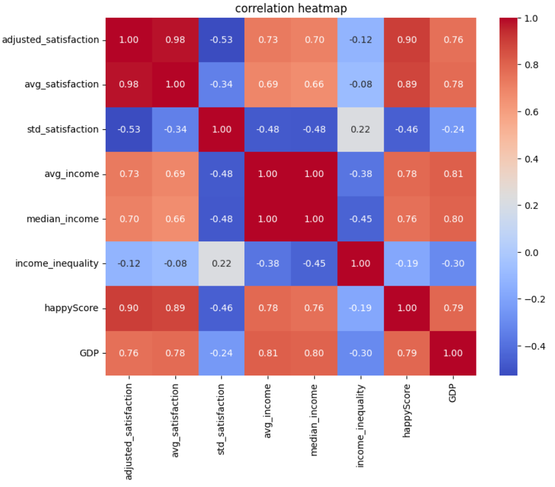
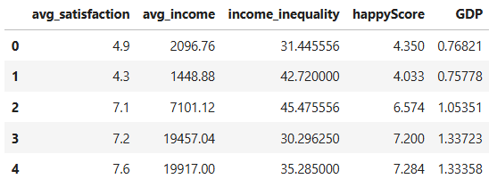
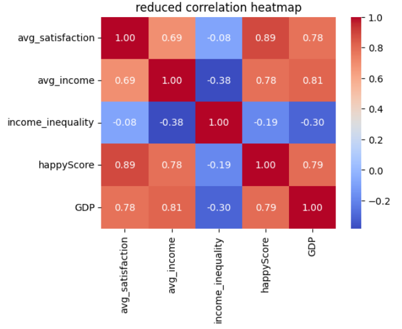
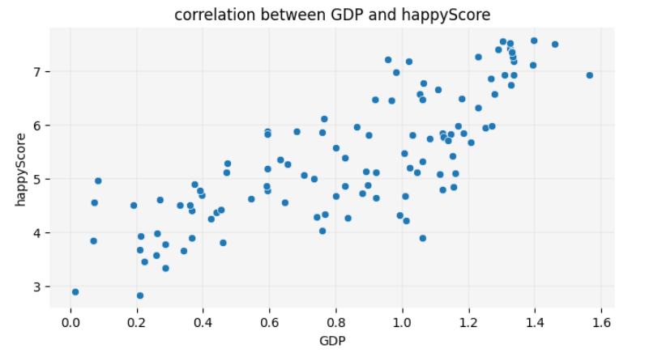
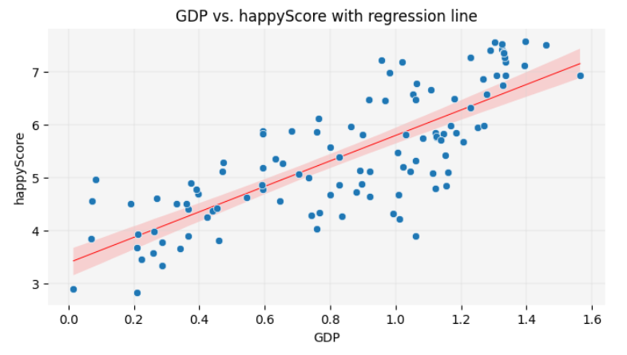
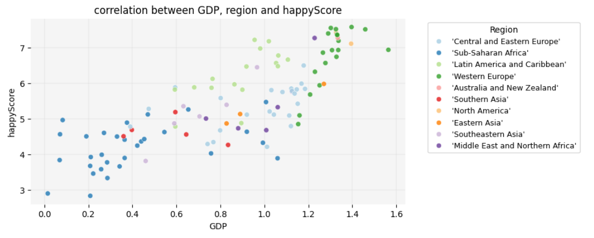
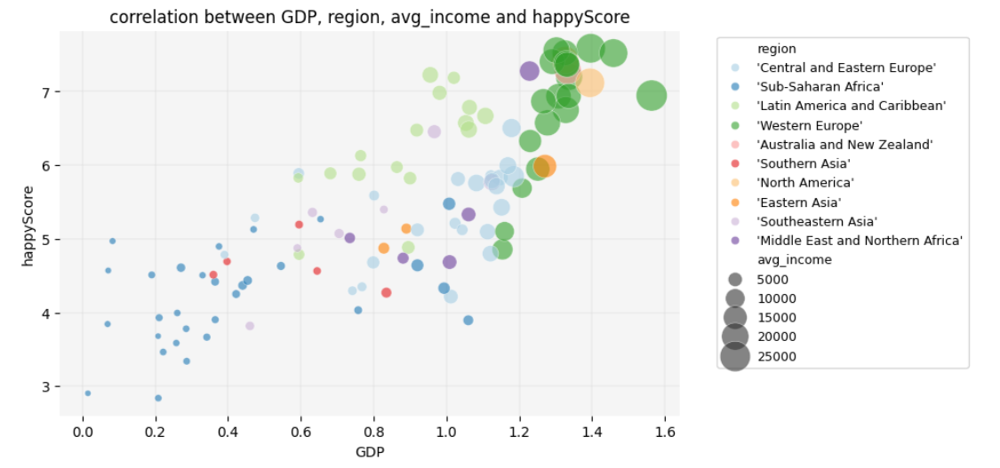
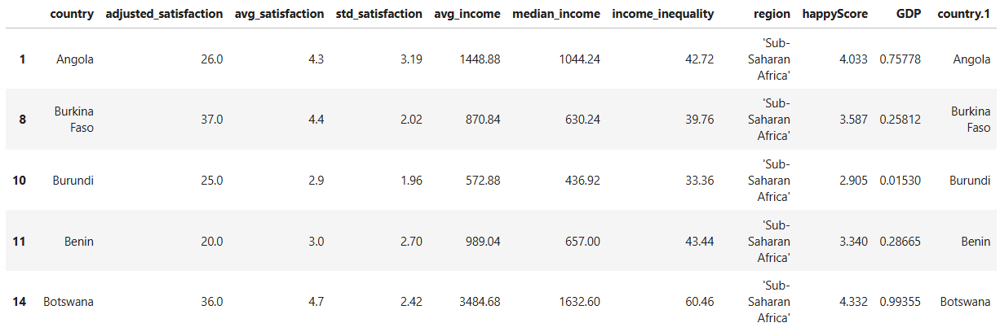
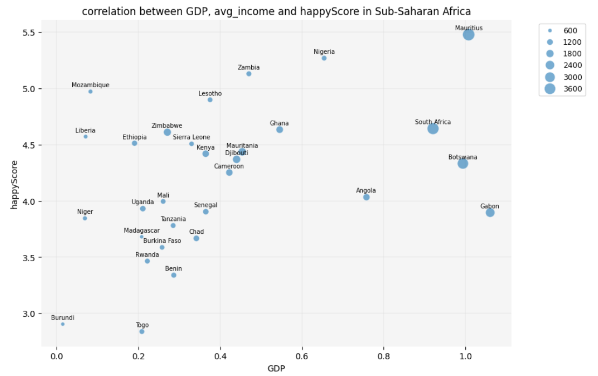

<span style="color: red;">Update teaching time and number of exercises.</span>

:::::::::::::::::::::::::::::::::::::: questions 

- How can you create scatter plots, bubble charts, and correlograms with Python?
- When are these graphs useful for inferring information from data?
- How are these visualizations valuable for humanists?

::::::::::::::::::::::::::::::::::::::::::::::::

::::::::::::::::::::::::::::::::::::: objectives

- Create scatter plots, bubble charts and correlograms in Python, using the Seaborn library
- Understand the process of creating these graphs to infer information from a dataset
- Comprehend how these graphs can be used to infer insights from humanities data and for data storytelling

::::::::::::::::::::::::::::::::::::::::::::::::

In the previous episodes, we explored ten types of graphs and their use cases, as well as the concepts of correlation 
and regression in the context of inferential statistics. Now, it’s time to put this knowledge into practice! 
In this episode, we’ll work with the *Income and Happiness Correlation dataset* from Kaggle (see the Setup episode), 
which consists of 111 data points. We’ll visualize this dataset and learn how to perform inferential statistical 
analysis on it.

::::::::::::::::::::::::::::::::::::::: discussion

### Note

Before visualizing any dataset, it’s important to answer the following questions:

1. What kind of data is stored in the dataset?
2. What are the dimensions of the dataset?
3. Why do I want to visualize the dataset? What information do I hope to gain through visualization? 
And which type of graph best represents the information I'm looking for?

Let’s answer these questions for our dataset by writing some code.

:::::::::::::::::::::::::::::::::::::::::::::::::::


## 4.1. Exploring the Dataset

The dataset we're working with is stored in a CSV (comma-separated values) file on GitHub. Let's load it into 
our notebook and store it in a pandas DataFrame called `happy_df`: 

```
import pandas as pd

# path to the dataset: 
url= "https://raw.githubusercontent.com/HERMES-DKZ/data_challenges_data_carpentries/main/\
data_carpentries/statistical_inferece_data_visualization/data_statistical_inference_data_visualization/income_happiness_correlation.csv"

# loading the dataset and storing it in a pandas DataFrame:
happy_df= pd.read_csv(url)

# displaying the first five rows of the DataFrame: 
happy_df.head()

```


Take a moment to examine the first five rows of the DataFrame. What types of values do you see in each column? 
Which columns contain numerical values, and which contain categorical values? What information does the dataset 
include, and what information might be missing?

Run the following line of code to gain more information about the structure of `happy_df`: 

```
# displaying information about the DataFrame:
happy_df.info()
```


::::::::::::::::::::::::::::::::::::: challenge 

## Question

Now that you know the dataset better, you can answer the question: what information can be *inferred* from 
this dataset? Which column contains values that could be dependent on other features, and thereby correlates 
with them? Would it be possible to predict the values of this column, given the values of one or more other 
columns in the dataset?

:::::::::::::::::::::::: solution 

## Answer
 
Intuitively, one might assume that the `happyScore` column contains values that could be predicted based on 
the other features. So, it may be possible to estimate the average happiness score of a country’s population 
if we know its region, GDP, income inequality, and average income. In other words, there might be a correlation 
between `happyScore` and the other features.

But how can we determine with greater confidence that such a correlation exists, and identify which features 
are more strongly correlated with `happyScore` than others? Data visualization can help us answer these questions.

:::::::::::::::::::::::::::::::::
::::::::::::::::::::::::::::::::::::::::::::::::

## 4.2. Drawing Heatmaps

One of the best and easiest ways to visualize correlations is through correlographic heatmaps. However, heatmaps 
can only show how changes in one *numerical value* are correlated with changes in another *numerical value*. 
Therefore, to create a heatmap of all numerical features that could be correlated with `happyScore`, we need to 
exclude the columns in `happy_df` that contain non-numerical values:

```
# selecting only the columns whose values are not of type 'object' and storing them in a new DataFrame:
numerical_df= happy_df.select_dtypes(exclude=['object'])

# displaying the first five rows of the new DataFrame:
numerical_df.head()
```


Now, let's use the Python library [Seaborn](https://seaborn.pydata.org/) to create a heatmap of all the values 
in `numerical_df`:

```
import matplotlib.pyplot as plt
import seaborn as sns

# creating a matrix that contains the correlation of every feature in the DataFrame with every other feature:
corr= numerical_df.corr(method='pearson')

# defining the size of the graph: 
plt.figure(figsize=(9, 7))

# generating a heatmap of the corr matrix, using the seaborn library:
sns.heatmap(corr, annot=True, fmt=".2f", cmap='coolwarm', cbar=True)

# giving the graph a title:
plt.title('correlation heatmap')

# diyplaying the graph: 
plt.show()
```



In the code above, we’ve set `cmap='coolwarm'`. This means we want the heatmap to distinguish between negative 
and positive correlations using red and blue colors. More saturated shades of blue or red indicate stronger 
negative or positive correlation values

We've set `annot=True` in our code, which means we want the correlation coefficients to be displayed on the heatmap. 
The correlation coefficients are calculated using the [Pearson method](https://www.youtube.com/watch?v=k7IctLRiZmo) 
in `corr= numerical_df.corr(method='pearson')`. 

"The Pearson correlation measures the strength of the linear relationship between two variables. It has a value 
between -1 to +1, with a value of -1 meaning a total negative linear correlation, 0 being no correlation, and +1 
meaning a total positive correlation." ([ScienceDirect](https://www.sciencedirect.com/topics/computer-science/pearson-correlation#:~:text=content%20were%20calculated.-,The%20Pearson%20correlation%20measures%20the%20strength%20of%20the%20linear%20relationship,meaning%20a%20total%20positive%20correlation))

#### How to read and interpret the heatmap:

- Darker red colors, accompanied by values closer to +1, indicate stronger positive correlations. 
This means that as one value *increases* at a certain rate, the other *increases* at a similar rate.
- Darker blue colors, accompanied by values closer to -1, indicate stronger negative correlations. This means 
that as one value *increases* at a certain rate, the other *decreases* at a similar rate.

::::::::::::::::::::::::::::::::::::: challenge 

## Question

What patterns does the heatmap above reveal?

:::::::::::::::::::::::: solution 

## Answer
 
- Each feature is most strongly correlated with itself, with a correlation coefficient of +1.
- Values derived from the same feature demonstrate a high correlation. For example, the correlation 
coefficient between avg_satisfaction and adjusted_satisfaction is +0.98, because both stem from the 
satisfaction degree. The same is true about avg_income and median_income with the correlation coefficient being +1.

:::::::::::::::::::::::::::::::::
::::::::::::::::::::::::::::::::::::::::::::::::

To create a more precise graph without redundant information, let's retain only one column from the 
DataFrame that contains data on satisfaction or income, and remove the others:

```
# dropping a list of columns from numerical_df and storing the result in a new DataFrame:
reduced_numerical_df= numerical_df.drop(['adjusted_satisfaction', 'std_satisfaction', 'median_income'], axis=1)

reduced_numerical_df.head()
```



Let's create the heatmap again, this time using `reduced_numerical_df` insted of `numerical_df`:

```
corr= reduced_numerical_df.corr(method='pearson')
plt.figure(figsize=(5.5, 4))
sns.heatmap(corr, annot=True, fmt=".2f", cmap='coolwarm', cbar=True)
plt.title('reduced correlation heatmap')
plt.show()
```



::::::::::::::::::::::::::::::::::::::: discussion

### Insight

This heatmap is more meaninful than the previous one and reveals more insights:

- `avg_satisfaction` and `avg_income` have a correlation greater that +0.5, indicating that higher income 
is correlated with greater life satisfaction.
- There is a strong positive correlation between `avg_satisfaction` and `happyScore`.
- `avg_satisfaction` shows a positive correlation with `GDP`.
- There is a positive correlation between `avg_income` and `happyScore`.
- There is a positive correlation between `avg_income` and `GDP`.
- The slight negative correlation between `avg_income` and `income_inequality` is also interesting: as the average 
income in a country increases, income inequality tends to decrease.
- There is a negative correlation between `GDP` and `income_inequality`: higher GDP in a country is associated 
with lower income inequality.

:::::::::::::::::::::::::::::::::::::::::::::::::::

Let's take a closer look at the correlations we've observed between the `happyScore` and the other features by 
drawing different graphs. 

## 4.3. Drawing Scatter Plots

Now that we have a general understanding of the correlations within the `happy_df` dataset, let's take a closer 
look at these relationships. We’ll start by visualizing the correlation between `happyScore` and another variable 
with a strong positive correlation, such as `GDP`. To achieve this, we can create a scatter plot: 

```
# defining the size of the graph: 
plt.figure(figsize=(8, 4))

# creating a scatte plot, using the seaborn library:
sns.scatterplot(data=happy_df, x='GDP', y='happyScore', zorder=3)

"""
The following block of code enhances the visual appeal of the graph:
"""
# adding grid to the plot:
plt.grid(True, zorder=0, color='lightgray', linestyle='-', linewidth=0.3)

# removing all spines (edges):
sns.despine(left=True, bottom=True)

# setting the background color:
plt.gca().set_facecolor('whitesmoke')
"""
End of customization 
"""

# giving the graph a title:
plt.title('correlation between GDP and happyScore')

# diyplaying the graph: 
plt.show()
```



::::::::::::::::::::::::::::::::::::::: discussion

### Fun Fact

You are now one step away from understanding how machine learning models predict values. Such a 
model calculates relationships between features, as shown above, and *fits* a line to represent them. This 
involves drawing a line on the scatter plot so that the sum of the squared distances from each point to the 
line is minimized. This line, as you learned in the previous chapter, is called a *regression line*. 
The method used to calculate the line's position is known as *linear regression* in statistics. Here is the 
code to display the regression line on the graph:

```
plt.figure(figsize=(8, 4))

sns.scatterplot(data=happy_df, x='GDP', y='happyScore', zorder=3)

plt.grid(True, zorder=0, color='lightgray', linestyle='-', linewidth=0.3)
sns.despine(left=True, bottom=True)
plt.gca().set_facecolor('whitesmoke')

# adding a regression line to the graph:
sns.regplot(data=happy_df, x='GDP', y='happyScore', scatter=False, color='red', line_kws={'zorder': 2, 'linewidth': 0.7})

plt.title('GDP vs. happyScore with regression line')
plt.show()
```



:::::::::::::::::::::::::::::::::::::::::::::::::::

The scatter plot reconfirms the insights we gained from the heatmap, visually demonstrating the positive correlation 
between `GDP` and `happyScore`: as the value of `GDP` on the X-axis increases, the `happyScore` on the Y-axis 
also tends to increase.

What if we also wanted to visualize the region of each country represented by a dot in the scatter plot? Unlike 
the heatmap, which couldn’t display regions due to their categorical nature, the scatter plot allows us to assign 
a unique color to each region. This way, we can see which regions tend to have the highest `GDP` and `happyScore` 
values:

```
plt.figure(figsize=(8, 4))

# adding region to the graph as hue:
sns.scatterplot(data=happy_df, x='GDP', y='happyScore', hue='region', palette='Paired', alpha=0.8, zorder=3)

plt.grid(True, zorder=0, color='lightgray', linestyle='-', linewidth=0.3)
sns.despine(left=True, bottom=True)
plt.gca().set_facecolor('whitesmoke')

# adding a legend to the graph:
plt.legend(title='Region', title_fontsize='10', fontsize='9', bbox_to_anchor=(1.05, 1), loc='upper left')

plt.title('correlation between GDP, region and happyScore')
plt.show()
```



::::::::::::::::::::::::::::::::::::::: discussion
### Insight

Interesting! Here are some observable trends in the graph: 

- Sub-Saharan African countries have the lowest GDPs, whereas Western European and North American countries have 
the highest. However, there are countries in the former region in which the `happyScore` is as high as in some 
Western European countries, regardless of their very low GDP.
- GDP is highest in Western European countries. However, `happyScore` in a considering number of them is similar 
to countries in Latin American and Caribbean, even though GDP in these latter regions is lower.
- The variation in happiness levels within the same region is greatest among Western European countries, 
although they all fall into the highest GDP category. 

Take a closer look at the graph and see if you can identify any additional trends.

:::::::::::::::::::::::::::::::::::::::::::::::::::

## 4.4. Drawing Bubble Charts

Let’s add one more variable to the graph to explore how `avg_income` is distributed across different regions 
and how it correlates with `region`,  `GDP` and `happyScore`. We’ll add `avg_income` as the node size in the 
scatter plot, creating a bubble chart:

```
plt.figure(figsize=(8, 5))

# adding avg_income to the graph as node size:
sns.scatterplot(data=happy_df, x='GDP', y='happyScore', hue='region', size='avg_income', sizes=(20,500), palette='Paired', alpha=0.6, zorder=3)

plt.grid(True, zorder=0, color='lightgray', linestyle='-', linewidth=0.3)
sns.despine(left=True, bottom=True)
plt.gca().set_facecolor('whitesmoke')
plt.legend(fontsize='9', bbox_to_anchor=(1.05, 1), loc='upper left')

plt.title('correlation between GDP, region, avg_income and happyScore')
plt.show()
```



Here, another interesting trend emerges: average income only begins to increase significantly once GDP exceeds 
a value of 1.

What additional insights can you derive from this graph? Consider exploring patterns such as which regions have 
high `happyScore` values relative to `avg_income`. You might also observe whether certain regions exhibit consistent 
patterns between `avg_income` and `happyScore` despite differences in `GDP`.

## 4.5. Diving Deeper into Details

As a final step in our exploration, let’s focus on the countries in Sub-Saharan Africa to identify which ones have 
a low `GDP` but a high `happyScore`:

```
# selecting only the countries that belong to the Sub-Saharan Africa and storing them in a new DataFrame:
african_df= happy_df[happy_df['region']=="'Sub-Saharan Africa'"]

african_df.head()
```



```
plt.figure(figsize=(10, 7))

sns.scatterplot(data=african_df, x='GDP', y='happyScore', size='avg_income', sizes=(20, 200), alpha=0.6, zorder=3)

plt.grid(True, zorder=0, color='lightgray', linestyle='-', linewidth=0.3)
sns.despine(left=True, bottom=True)
plt.gca().set_facecolor('whitesmoke')

# adding country names to the nodes:
for i in range(len(african_df)):
    plt.text(
        african_df['GDP'].iloc[i],
        african_df['happyScore'].iloc[i]+0.03,
        african_df['country'].iloc[i],
        fontsize=7,
        ha='center',
        va='bottom'
    )

plt.legend(fontsize='9', bbox_to_anchor=(1.05, 1), loc='upper left')
plt.title('correlation between GDP, avg_income and happyScore in Sub-Saharan Africa')
plt.show()
```



Let’s examine this scatter plot and compare it with the heatmap we created earlier:

The scatter plot reveals that some economically poor countries in Sub-Saharan Africa, such as Mozambique and 
Liberia, have a low `GDP` and `avg-income` but still demonstrate a high `happyScore`.


::::::::::::::::::::::::::::::::::::: challenge 

## Question

But didn’t the heatmap show a positive correlation between happiness and GDP? Isn’t this a contradiction?!

:::::::::::::::::::::::: solution 

## Answer
 
Yes and no! Remember, we excluded categorical data, such as region and country names, from `happy_df` to create 
the heatmap. By analyzing only numerical values, we observed a generally positive correlation between `GDP` and 
`happyScore`. However, the scatter plots and bubble chart suggest that cultural factors specific to each country 
significantly influence happiness. This impact is especially visible among Sub-Saharan African countries.

Therefore, if we want to draw an inferential conclusion from our observations, it would be this: happiness appears 
to be influenced by a combination of GDP, income, and cultural factors. To predict a country’s `happyScore` based 
on our findings, we would need to know its region (which reflects GDP and cultural context) and possibly the 
country’s average income level.

:::::::::::::::::::::::::::::::::
::::::::::::::::::::::::::::::::::::::::::::::::

## 4.6. Exercise

Take two countries that are not listed in the DataFrame, for example Iran and Turkey. Given the correlations 
that we have so far inferred from the dataset, try to predict how high their `happyScore` is. To do so, you 
need the following information: 

- Which region do these countries belong to? Which countries in `happy_df`are culturally more similar to 
Iran and Turkey? 
- How high are `GDP` and `avg_income` in these countries?

look at the scatter plot with a regression line and the bubble chart and try to predict where these two countries, 
Iran and Turkey, would be placed on the chart. 

::::::::::::::::::::::::::::::::::::: keypoints 

- Draw scatter plots, correlograms and bubble chart to infer information from a given dataset
- Process of storytelling with data, using visualization to create a narrative and predict values

::::::::::::::::::::::::::::::::::::::::::::::::

